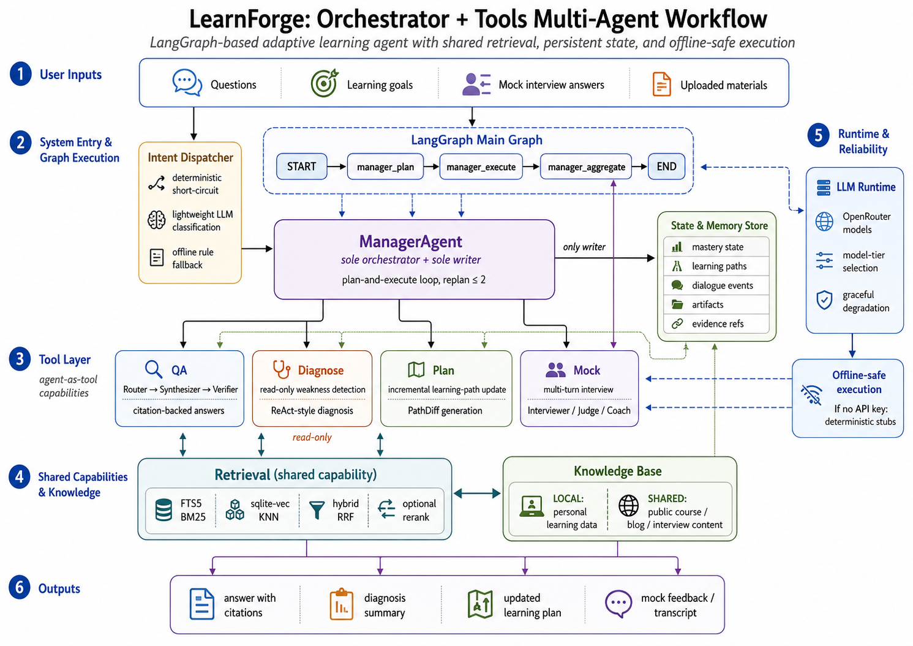
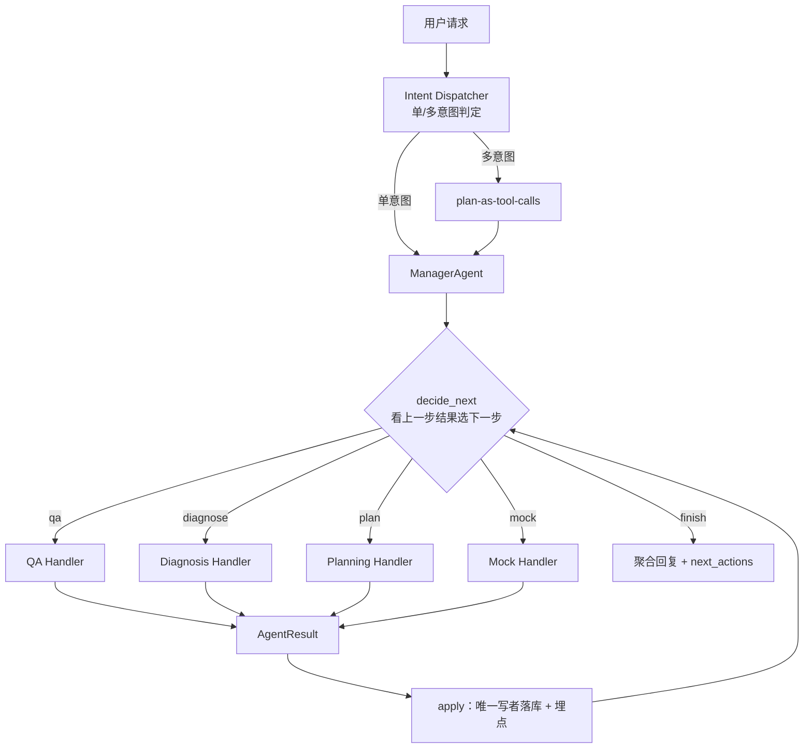
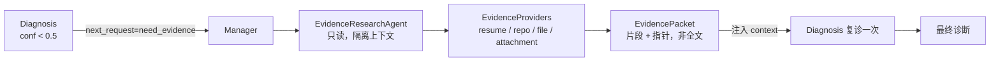

# LearnForge

> 面向程序员的**学习陪练 Agent** —— 以 **orchestrator + tools** 多智能体架构构建，跑在
> LangGraph / FastAPI / SQLite(FTS5 + sqlite-vec) 之上。


LearnForge 把零散的学习信号 —— 你问的技术问题、模拟面试里的回答、学习目标 —— 沉淀成
**可查询的持久状态**，再驱动**弱点诊断**与**学习规划**。一个主 Agent(`ManagerAgent`) 负责规划与派发，
每个领域能力都是它调用的一个**工具**(agent-as-tool)；它是**唯一编排者**，也是共享状态的**唯一写者**。

> **离线优先**：没有 `OPENROUTER_API_KEY` 时，每个工具都回退到确定性兜底（“链路永远通”），
> 全套测试无需联网、不计费。

---

## ✨ 解决的痛点

- **学习信号零散**：八股问答、刷题、模拟面试各自为政，没有沉淀，复盘无依据。
- **不知道自己哪里薄弱**：缺一个基于真实交互信号 + 掌握度的**只读诊断**。
- **面试准备没有系统路径**：诊断完不知道接下来学什么、怎么排期、如何验收。
- **回答不可核验**：八股/项目问答容易“编造引用”，缺少证据绑定与降级机制。

## 🧩 核心能力

| 工具 | 角色 | 运行档 |
|---|---|---|
| **qa** | 检索增强问答（Router → Synthesizer → Verifier），带引用、可核验、无证据自动降断言 | Haiku/Sonnet |
| **diagnose** | **只读**弱点诊断：聚合 `interaction_events` + 掌握度，产弱点簇 + 复习建议（ReAct） | Sonnet |
| **plan** | 生成 / 调整学习路径，只产**增量** `PathDiff`（由 Manager 落库） | Sonnet |
| **mock** | 多轮模拟面试，由 **InterviewDirector** 每回合智能选下一步动作（出题/追问/纠错/收尾） | Haiku/Sonnet/强档 |
| **evidence** | 统一**只读证据 worker**：隔离上下文读 resume/repo/file/attachment，回精炼 `EvidencePacket` | Haiku |
| **retrieval** | 共享 RAG：keyword / FTS5 BM25 / sqlite-vec KNN / hybrid(RRF) + 可选 rerank | Haiku |

> `research` 已设计、尚未实现。Router / Synthesizer / Judge / Coach 等是**工具内部的子步骤**，不是对外工具。

## 🛠 技术栈

- **编排**：LangGraph（薄外壳）+ `ManagerAgent` 手写 ReAct（decide → dispatch → apply）
- **服务**：FastAPI（`/ui/chat` 统一入口 + 多模态附件）
- **存储**：SQLite + FTS5（BM25）+ sqlite-vec（向量 KNN），无向量库自动降级为 FTS
- **契约**：Pydantic（contract-first，先定 schema 再实现）
- **LLM**：OpenRouter（OpenAI 兼容），可选 embeddings（openai / voyage），无 key → 确定性兜底
- **语言**：Python 3.11

## 🏗 系统架构



LearnForge 是 **orchestrator + 可插拔 Handler** 架构。`ManagerAgent` 不预拆死 DAG，而是**每步看子 Agent 的
结果再决定下一步**；新增能力 = 注册一个 `CapabilityHandler`，**无需改 Manager 主循环**。

- **统一结果契约 `AgentResult`**：子 Agent 回 `status / confidence / payload / evidence_refs /
  artifact_refs / next_request / reason`，Manager 据此决定下一步，**不需要知道底下是哪个能力**。
- **三类可插拔 Handler 协议**
  - `CapabilityHandler` —— qa / diagnose / plan / mock / evidence 等对外能力（经 `HandlerRegistry` 分发）；
  - `EvidenceProviderHandler` —— resume / repo / file / attachment / retrieval 等证据来源；
  - `ToolHandler` —— file.read/write/edit、mcp.*、retrieval 等底层工具。
- **Evidence 子系统 + `need_evidence` 回路**：Diagnosis 信号不足时**返回 `need_evidence`**，而不是自己读一堆
  source —— 由 Manager 调统一只读 `EvidenceResearchAgent` 补证据、注入后复诊（证据本体不进 Conversation State，
  只回片段 + 指针）。
- **Tool / Skill / Permission**：每个能力的工具权限由其 `Skill.allowed_tools` 声明，运行期经
  `require_tool` 双闸把守（注册 ≠ 授权）；`CAPABILITY_REGISTRY` 是内部能力权限目录；`file.write/edit`
  默认 dry-run + 沙箱 + 显式开关三重安全，**不引入 shell/exec**。

## 🔗 执行链路

**Manager 动态编排（decide → dispatch → apply）**



**need_evidence 回路（Diagnosis 信号不足 → 统一证据 worker）**



> 复合“准备面试”由 ReAct 自然续跑：`diagnose` → 看结果 → `plan.modify`；诊断为空则跳过改计划、改建议先 `mock`。

## 🧱 关键设计不变量

- **Manager 是唯一写者**：只有它写 `knowledge_atoms` 掌握度与 `learning_paths`；`DiagnosisAgent` **严格只读**。
- **链路永远通**：无 API key 不阻断；每个工具都有确定性 stub，测试全程离线。
- **证据边界**：Conversation State 只放摘要 / 最近事件 / artifact 引用；完整附件 / repo 文件 / 工具日志只进
  Evidence 层并截断，大内容按需拉取。
- 所有 `*_id` 为 UUID 字符串；时间戳为 SQLite 里的 ISO-8601 UTC 文本。

## 🚀 快速开始

```bash
cd learnforge
pip install -e ".[dev]"                       # Python 3.11+

pytest                                         # 全套测试，完全离线
python -m learnforge.graph.main_graph          # smoke-run 主图
python -m learnforge.cli                        # 交互式 CLI
uvicorn learnforge.app:api --reload            # 启动 API 服务
```

把 `OPENROUTER_API_KEY` 写进未跟踪的 `.env`（见 [`.env.example`](.env.example)）即可启用 LLM；
不配置则优雅降级为确定性兜底。

## 📁 项目结构

```
learnforge/                 项目根（pyproject / conftest / tests）
├─ learnforge/              Python 包
│  ├─ orchestration/        ManagerAgent · HandlerRegistry · CapabilityHandlers · planner
│  ├─ agents/               qa · diagnosis · planning · mock · evidence · retrieval
│  ├─ contracts/            AgentResult · handlers(协议) · 各工具 Input/Output · enums
│  ├─ intent/               Dispatcher（自然语言 → 路由）
│  ├─ knowledge/            双层知识库 + 可插拔 RAG（FTS / vector / hybrid）
│  ├─ skills/               运行时人格 + 权限（Skill.allowed_tools）
│  ├─ tools/                CAPABILITY_REGISTRY · 受控文件工具 · 证据源工具
│  ├─ memory/               会话压缩 + daily 长期记忆
│  └─ storage/              schema.sql · repositories
├─ data/                    运行时记忆数据
└─ runtime/                 出图风格源
docs/                       architecture/ · updates/ · module-updates/ · archive/ · assets/
infra.png                   架构结构图
CLAUDE.md                   工程指南 / 架构参考
```

## 📚 文档

- [`CLAUDE.md`](CLAUDE.md) —— 工程指南与架构参考（单一真值）
- [`docs/README.md`](docs/README.md) —— 文档地图
- [`docs/architecture/refactor-plan.md`](docs/architecture/refactor-plan.md) —— 轻量 DDD + 可插拔 Handler 重构方案
- [`docs/updates/index.html`](docs/updates/index.html) —— 重构阶段更新日志

## 🧭 后续演进

- **Phase 7**：`ResponsePayload` 全量切 `AgentResult`，移除 Manager 的旁路 dict（`meta`/`context`）。
- **`research` 工具**：首个真 tool-calling ReAct（只读），复用 `EvidenceProvider` 体系。
- **Tool descriptor 合并**：`ToolSpec`(权限) ↔ `BaseTool`(schema/handler) 统一为单一 `ToolHandler`。
- **测试体系重设计**：基于新的 handler / registry / `AgentResult` 架构重建测试。

## License

详见仓库。
